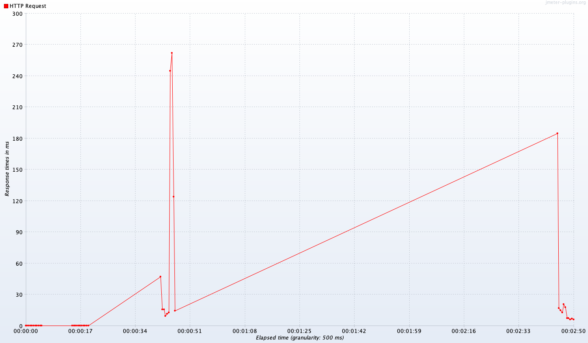
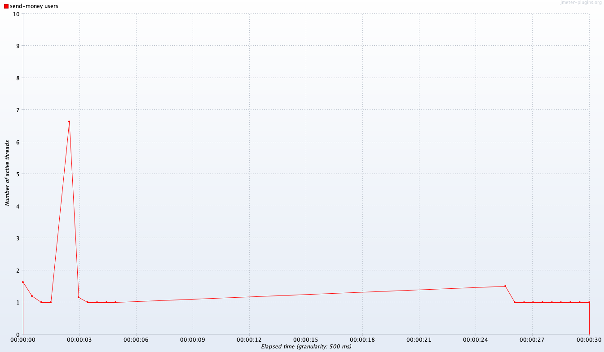

# EXBank Non Function Test

This project is designed to create, execute, and analyze performance and load testing scenarios using Apache JMeter. JMeter is a widely-used, open-source Java-based tool that allows you to test the performance of web applications, APIs, and other network services under different load conditions.

## Backend Simulation

We use [MockServer](https://www.mock-server.com/) to simulate API responses. MockServer is set up with Docker Compose.

### Setup

1. **Clone the Repository:**

   ```sh
   git clone https://github.com/your-username/jmeter-project.git
   ```

**Note** : mock server operates on port 1080 with dashboard url http://localhost:1080/mockserver/dashboard

**Performance test results for user API**


**Performance test results for balance API**


**Performance test results for send money API**

